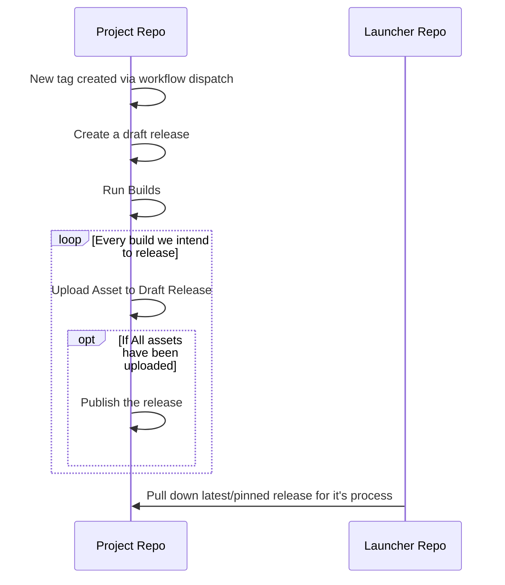

# Release Process

```mermaid
sequenceDiagram
  Project Repo->>Project Repo: New tag created via workflow dispatch
  Project Repo->>Project Repo: Create a draft release
  Project Repo->>Project Repo: Run Builds
  loop Every build we intend to release
    Project Repo->>Project Repo: Upload Asset to Draft Release
    opt If All assets have been uploaded
      Project Repo->>Project Repo: Publish the release
    end
  end
  Launcher Repo->>Project Repo: Pull down latest/pinned release for it's process
```
