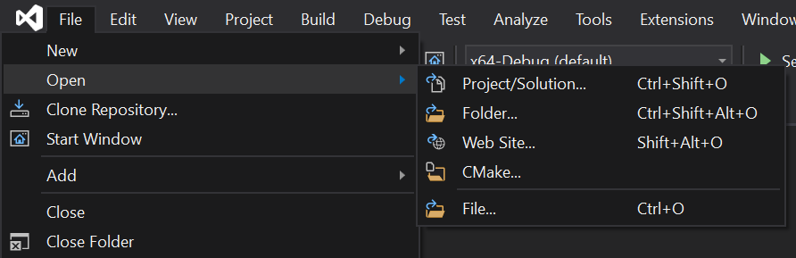
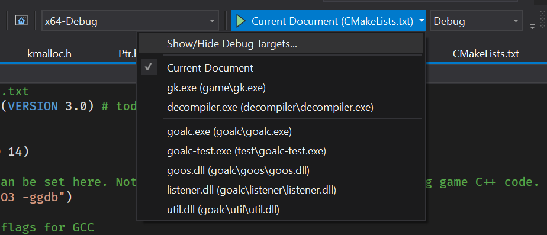
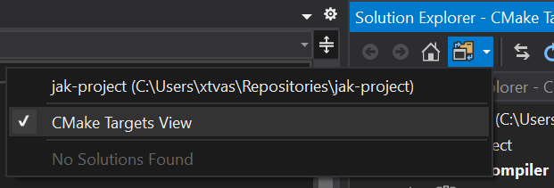

# Jak Project


[](https://coveralls.io/github/water111/jak-project?branch=master)

## Table of Contents

<!-- toc -->

- [Table of Contents](#table-of-contents)
- [Requirements](#requirements)
- [Getting Started - Linux (Ubuntu)](#getting-started---linux-ubuntu)
- [Getting Started - Windows](#getting-started---windows)
- [Project Description](#project-description)
- [Project Layout](#project-layout)
- [Design](#design)
- [Coding Guidelines](#coding-guidelines)
- [TODOs](#todos)
  - [GOAL Decompiler](#goal-decompiler)
  - [GOAL Runtime](#goal-runtime)
  - [GOAL Compiler](#goal-compiler)
  - [Asset Extraction Tool](#asset-extraction-tool)
  - [Asset Packing Tool](#asset-packing-tool)

<!-- tocstop -->

## Requirements

- `cmake` for build system
- `clang-format` for formatting code (there is already a `.clang-format` provided)
- `gtest` for testing. (Run `git submodule update --init --recursive` to check out the repository)
- `nasm` for assembling x86
- Third party libraries (`nlohmann/json`, `minilzo`, and `linenoise`) are provided in the `third-party` folder

## Getting Started - Linux (Ubuntu)

Install Packages and Init Repository

```bash
sudo apt install gcc make cmake build-essential g++ nasm clang-format
git submodule update --init --recursive
```

Compile

```bash
mkdir build && cd build && cmake .. && make -j
```

Run Tests

```bash
./test.sh
```

## Getting Started - Windows

Install Visual Studio 2019 and get the C++ and CMake tools via the Visual Studio Installer

On Windows, it's recommended to get Scoop to use as a package manager, making the follow steps _much_ easier. Follow the steps on the bottom of the homepage here https://scoop.sh/

Once Scoop is installed, run the following command:

```ps
scoop install llvm nasm
```

Initialize the repository's third-party dependencies:

```bash
git submodule update --init --recursive
```

Open the project as a CMake project, browse for the root level `CMakeLists.txt`:



In the toolbar, you should be able to select an individual component to compile, or combine within the root CMakeLists.txt. In the future we will pre-define configurations to make this easier.



You may also wish to view the files that pertain to each CMake target, rather than the project as it is normally:



TODO

- more steps to follow as we actually figure it out!
- running tests
- etc

## Project Description

This project is to port Jak 1 (NTSC, "black label" version) to PC. The strategy is to:

- recompile for x86 to get much better performance than emulation
- create human-reabable GOAL source code that can be modified
- create a GOAL compiler for x86-64 which supports live patching of code like the original
- attempt to match the original game as close as possible (for no reason other than it's fun)
- unpack assets in a format that can be modified

There are 6 components to this project

- GOAL decompiler. The result will be manually cleaned up for running on a PC.
- GOAL compiler for x86-64.
- Game source code, made from cleaning up the result of the GOAL decompiler.
- GOAL runtime. This will replace the parts of the game written in C++
- Asset extraction tool to extract the models/textures/large data from the game
- Asset packing tool.

The process to build the port will be

- Build data extraction tool, GOAL compiler, and GOAL runtime library (all written in C++)
- Run the GOAL compiler on the game source code to build the game engine
- Run asset extraction on the game disc to get level data, textures, geometry data, music...
- Run the asset packing tool to combine the unpacked assets with the compiled game engine to create the game!

Some statistics:

- Estimated ~500k lines of GOAL code
- 10410 functions
- 5451 functions with no control flow (no branching, loops, if/else, short-circuiting boolean operators, gotos, etc)

The rough timeline is to finish sometime in 2022. If it looks like this is impossible, the project will be abandoned. But I have already spent about 4 months preparing to start this and seems doable. I also have some background in compilers, and familiarity with PS2 (worked on DobieStation PS2 emulator) / MIPS in general (wrote a PS1 emulator). I think the trick will be making good automated tools - the approach taken for SM64 and other N64 decompilations is way too labor-intensive to work.

## Project Layout

- `goalc` is the GOAL compiler
- `decompiler` is the decompiler
- `decompiler_out` is the decompiler output
- `data` will contain big assets and the output of the GOAL compiler (not checked in to git)
- `out` will contain the finished game (not checked into git)
- `resources` will contain data which is checked into git
- `game` will contain the game source code (C/C++)
- `goal_src` will contain GOAL source code for the game
- `common` will contain all data/type shared between different applications.
- `doc` will contain documentation
- `iso_data` is where the files from the DVD go
- `third-party` will contain code we didn't write. Google Test is a git submodule in this folder.
- `tests` will contain all tests
- `asset_tool` will contain the asset packer/unpacker

## Design

(if anybody has better ideas, feel free to suggest improvements! This is just a rough plan for now)

- All C++ code should build from the top-level `cmake`.
- All C++ applications (GOAL compiler, asset extractor, asset packer, runtime, test) should have a script in the top level which launches them.
- All file paths should be relative to the `jak` folder.
- The planned workflow for building a game:
  - `git submodule update --init --recursive` : check out gtest
  - `mkdir build; cd build` : create build folder for C++
  - `cmake ..; make -j` : build C++ code
  - `cd ..`
  - `./test.sh` : run gtests
  - `./asset_extractor.sh ./iso_data` : extract assets from game
  - `./build_engine.sh` : run GOAL compiler to build all game code
  - `./build_game.sh` : run the asset packer to build the game
  - `./run_game.sh` : run the game
- Workflow for development:
  - `./gc.sh` : run the compiler in interactive mode
  - `./gs.sh` : run a goos interpreter in interactive mode
  - `./decomp.sh : run the decompiler

## Coding Guidelines

- Avoid warnings
- Use asserts over throwing exceptions in game code (throwing exceptions from C code called by GOAL code is sketchy)

## TODOs

- Clean up header guard names (or just use `#pragma once`?)
- Investigate a better config format
  - The current JSON library seems to have issues with comments, which I really like
- Clean up use of namespaces
- Clean up the print message when `gk` starts.
- Finish commenting runtime stuff
- Runtime document
- GOOS document
- Listener protocol document
- Gtest setup for checking decompiler results against hand-decompiled stuff
- Clean up decompiler print spam, finish up the CFG stuff
- Decompiler document

### GOAL Decompiler

The decompiler is in progress, at
https://github.com/water111/jak-disassembler

Here is the plan for writing the decompiler:

- [x] Decode the CGO/DGO format.
- [x] Decode the linking data format.
- [x] Identify all code and disassemble
- [x] Recover references
- [x] Split code into functions, and build a graph of basic blocks
- [ ] Create a control flow graph for each function (currently succeeds for 9857/10410 functions)
- [ ] Extract type/method information from debug data
- [ ] Convert instructions to an intermediate representation (IR) and eliminate GOAL/MIPS idioms
- [ ] Regsiter liveness analysis
- [ ] Type propagation
- [ ] Variable map and scoping
- [ ] S-expression construction (expression stack)

### GOAL Runtime

The "runtime" will be a replacement for all of the C/C++ code of the original game. There is C/C++ code that runs on the main processor (EE) and the separate I/O processor (IOP).

- The "C Kernel", which runs on the EE and contains
  - [ ] File I/O (for debugging, not used by retail game)
  - [x] Initialization to boostrap the GOAL Kernel and start the game engine
  - [x] Connection to compiler for debugging/live code patching
  - [x] Interface to OVERLORD (see next section) for DGO loading
  - [x] GOAL Linker
  - [ ] PS2-specific hardware initialization as required by Sony libraries
  - [x] GOAL "kheap" allocator
  - [ ] Memory card interface
  - [x] GOAL printf (called `format`) implementation
  - [x] GOAL hash/symbol table implementation
  - [x] Implementation of some built-in GOAL methods/functions
- The "OVERLORD" IOP driver, which ran on the PS2's separate I/O Processor for loading things off the DVD and doing sound things
  - [x] DGO loader
  - [x] File system for loading from DVD or "fakeiso" mode for loading from a folder
  - [x] "ISOThread" queue system for prioritizing reads
  - [ ] Sound stuff
  - [ ] Streaming animation stuff
  - [ ] Ramdisk stuff (implemented but totally untested)
- The "989_snd" sound driver (no progress has been made here, the rough plan is to do a high level emulation of the sound system)
- Sony libraries
  - [x] SIF (interface between EE/IOP for sending data, receiving data, and making remote procedure calls)
  - [x] IOP Kernel (single-processor non-preemptive multitasking)
  - [x] stubs for stuff that doesn't really matter

The "Sony libraries" are a simple wrapper around my `system` library, which implements the threading/communication stuff.

Likely there will be sound/graphics code in here at some point, but this part is not fully planned yet.

### GOAL Compiler

The GOAL compiler will target x86-64. At first just Linux. There is a macro language called GOOS which is basically just Scheme but with a few bonus features.

The compiler will reuse a significant amount of code from my existing LISP compiler for x86-64. I have a very bad WIP combination which is capable of building a modified `gkernel.gc` for x86 as a proof of concept. It can create and run functions in threads.

An important part of the compiler is the test suite. Without tests the compiler will be full of bugs. So every feature should have a good set of tests.

### Asset Extraction Tool

Not started yet. The simplest version of this tool is just to use the decompiler logic to turn the level/art-group/texture/TXT files into GOAL source code, and copy all STR/sound/visibility files, as these don't need to be modified.

Eventually this should export to a more useful format.

File formats:

- [ ] Art group (a GOAL object format)
  - There may be more formats related to art groups.
- [ ] Texture page (a GOAL object format)
  - [ ] Texture page directory (a GOAL object format)
- [ ] Level (`vis-bt`) (a GOAL object format)
- [ ] `TEXT/*.TXT` (text, a GOAL object format)
- [ ] `MUS` (sequenced music)
- [ ] `SBK` (sound bank)
- [ ] `STR` (streaming animation)
- [ ] `VAG` (ADPCM audio)
- [ ] `VIS` (visibility data bitstream)
- [ ] Loading screen image
- [ ] save game icon (I do not care about this)

### Asset Packing Tool

Packs together all assets/compiled code/runtime into a format that can be played. The simplest version to go with the simplest extraction tool will just pass the level/art-group/texture/TXT files to the compiler, and copy STR/sound/visbility files into the fakeiso. Then pack in CGOs/DGOs.

It's important that the asset extraction/packing can be automated so we can avoid distributing the assets, which are large and probably not supposed to be distributed.
