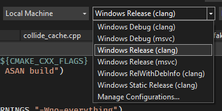

<p align="center">
  
</p>

<p align="center">
  <a href="https://open-goal.github.io/" rel="nofollow"></a>
  <a target="_blank" rel="noopener noreferrer" href="https://github.com/open-goal/jak-project/workflows/Linux/badge.svg"></a>
  <a target="_blank" rel="noopener noreferrer" href="https://github.com/open-goal/jak-project/workflows/Windows/badge.svg"></a>
  <a href="https://www.codacy.com/gh/open-goal/jak-project/dashboard?utm_source=github.com&utm_medium=referral&utm_content=open-goal/jak-project&utm_campaign=Badge_Coverage" rel="nofollow"></a>
  <a href="https://www.codacy.com/gh/open-goal/jak-project/dashboard?utm_source=github.com&amp;utm_medium=referral&amp;utm_content=open-goal/jak-project&amp;utm_campaign=Badge_Grade" rel="nofollow"></a>
  <a href="https://discord.gg/VZbXMHXzWv"></a>
  <a href="https://makeapullrequest.com"></a>
</p>

- [Read First](#read-first)
- [Project Description](#project-description)
- [Current Status](#current-status)
- [Getting Started - Linux](#getting-started---linux)
  - [Ubuntu (20.04)](#ubuntu-2004)
  - [Arch](#arch)
  - [Fedora](#fedora)
- [Getting Started - Windows](#getting-started---windows)
  - [Required Software](#required-software)
  - [Setting up and Opening the Project](#setting-up-and-opening-the-project)
- [Building and Running the Game](#building-and-running-the-game)
  - [Extract Assets](#extract-assets)
  - [Build the Game](#build-the-game)
  - [Run the Game](#run-the-game)
    - [Connecting the REPL to the Game](#connecting-the-repl-to-the-game)
    - [Running the Game Without Auto-Booting](#running-the-game-without-auto-booting)
  - [Interacting with the Game](#interacting-with-the-game)
- [Project Layout](#project-layout)

## Read First

The github repositories are for development of the project and tracking active issues.  Most of the information you will find here pertains to setting up the project for development purposes and is not relevant to a general user.

There is a discord server where discussion occur https://discord.gg/VZbXMHXzWv

Additionally you can find further information and answers to frequently asked questions on the project's main website https://open-goal.github.io/

## Project Description

This project is to port Jak 1 (NTSC, "black label" version) to PC. Over 98% of this game is written in GOAL, a custom Lisp language developed by Naughty Dog. Our strategy is:
- decompile the original game code into human-readable GOAL code
- develop our own compiler for GOAL and recompile game code for x86-64
- create a tool to extract game assets into formats that can be easily viewed or modified
- create tools to repack game assets into a format that our port uses.

Our objectives are:
- make the port a "native application" on x86-64, with high performance. It shouldn't be emulated, interpreted, or transpiled.
- Our GOAL compiler's performance should be around the same as unoptimized C.
- try to match things from the original game and development as possible. For example, the original GOAL compiler supported live modification of code while the game is running, so we do the same, even though it's not required for just porting the game.
- support modifications. It should be possible to make edits to the code without everything else breaking.

We support both Linux and Windows on x86-64.

## Current Status

So far, we've decompiled around 400,000 lines of GOAL code, out of an estimated 500,000 total lines from the original game. We have a working OpenGL renderer which renders most of the game world and foreground. Levels are fully playable, and you can finish the game with 100% completion!

Here are some screenshots of the renderer:


YouTube playlist:
https://www.youtube.com/playlist?list=PLWx9T30aAT50cLnCTY1SAbt2TtWQzKfXX

To help with decompiling, we've built a decompiler that can process GOAL code and unpack game assets. We manually specify function types and locations where we believe the original code had type casts (or where they feel appropriate) until the decompiler succeeds, then we clean up the output of the decompiled code by adding comments and adjusting formatting, then save it in `goal_src`. Our decompiler is designed specifically for processing the output of the original GOAL compiler. As a result, when given correct casts, it often produces code that can be directly fed into a compiler and works perfectly. This is tested as part of our unit tests, and so far we have over 300,000 lines (460 files) that pass.

We don't save any assets from the game - you must bring your own copy of the game and use the decompiler to extract assets.

## Getting Started - Linux

### Ubuntu (20.04)

Install packages and init repository:

```sh
sudo apt install gcc make cmake build-essential g++ nasm clang-format libxrandr-dev libxinerama-dev libxcursor-dev libpulse-dev libxi-dev python
sudo sh -c "$(curl --location https://taskfile.dev/install.sh)" -- -d -b /usr/local/bin
```

Compile:

```sh
cmake -B build && cmake --build build -j 8
```

Run tests:

```sh
./test.sh
```

Note: we have found that `clang` and `lld` are significantly faster to compile and link than `gcc`, generate faster code, and have better warning messages. To install these:

```sh
sudo apt install lld clang
```

and run `cmake` (in a fresh build directory) with:

```sh
cmake -DCMAKE_SHARED_LINKER_FLAGS="-fuse-ld=lld" -DCMAKE_EXE_LINKER_FLAGS="-fuse-ld=lld" -DCMAKE_C_COMPILER=clang -DCMAKE_CXX_COMPILER=clang++ ..
```

### Arch

Install packages and init repository:

```sh
sudo pacman -S cmake libpulse base-devel nasm python
yay -S go-task
```

For Arch only, replace `task` with `go-task` in the rest of the instructions.

Compile:

```sh
cmake -B build && cmake --build build -j 8
```

Run tests:

```sh
./test.sh
```

### Fedora

Install packages and init repository:

```sh
sudo dnf install cmake lld clang nasm libX11-devel libXrandr-devel libXinerama-devel libXcursor-devel libXi-devel pulseaudio-libs-devel
sudo sh -c "$(curl --location https://taskfile.dev/install.sh)" -- -d -b /usr/local/bin
```

Compile with `clang`:

```sh
cmake -DCMAKE_SHARED_LINKER_FLAGS="-fuse-ld=lld" -DCMAKE_EXE_LINKER_FLAGS="-fuse-ld=lld" -DCMAKE_C_COMPILER=clang -DCMAKE_CXX_COMPILER=clang++ -B build
cmake --build build -j$(nproc)
```

Run tests:

```sh
./test.sh
```

## Getting Started - Windows

### Required Software

We primarily use Visual Studio on Windows for C++ development.  Download the latest community edition from [here](https://visualstudio.microsoft.com/vs/)

You will require the `Desktop development with C++` workload.  This can be selected during the installation, or after via the `Visual Studio Installer`, modifying the Visual Studio Installation.

On Windows, it's recommended to use a package manager, we use Scoop. Follow the steps on the bottom of the homepage [here](https://scoop.sh/) to get it.

Once Scoop is installed, run the following commands:

```sh
scoop install git llvm nasm python task
```

### Setting up and Opening the Project

Clone the repository by running the following command in your folder of choice.

```sh
git clone https://github.com/open-goal/jak-project.git
```

This will create a `jak-project` folder, open the project as a CMake project via Visual Studio.


Then build the entire project as `Windows Release (clang)`. You can also press Ctrl+Shift+B as a hotkey for Build All.  We currently prefer `clang` on Windows as opposed to `msvc`, though it should work as well!




## Building and Running the Game

Getting a running game involves 4 steps:

1. Build C++ tools (follow Getting Started steps above for your platform)
2. Extract assets from the game
3. Build the game
4. Run the game

### Extract Assets

First, setup your settings so the following scripts know which game you are using, and which version.  In a terminal, run the following:

```sh
task set-game-jak1
task set-decomp-ntscv1
```

> Run `task --list` to see the other available options

> At the time of writing, only Jak 1 is expected to work end-to-end!

The first step is to extract your ISO file contents into the `iso_data/<game-name>` folder.  In the case of Jak 1 this is `iso_data/jak1`.

Once this is done, open a terminal in the `jak-project` folder and run the following:

```sh
task extract
```

### Build the Game

The next step is to build the game itself.  To do so, in the same terminal run the following:

```sh
task repl
```

You will be greeted with a prompt like so:

```sh
 _____             _____ _____ _____ __
|     |___ ___ ___|   __|     |  _  |  |
|  |  | . | -_|   |  |  |  |  |     |  |__
|_____|  _|___|_|_|_____|_____|__|__|_____|
      |_|
Welcome to OpenGOAL 0.8!
Run (repl-help) for help with common commands and REPL usage.
Run (lt) to connect to the local target.

g >
```

Run the following to build the game:

```sh
g > (mi)
```

### Run the Game

Finally the game can be ran.  Open a second terminal from the `jak-project` directory and run the following:

```sh
task boot-game
```

The game should boot automatically if everything was done correctly.

#### Connecting the REPL to the Game

Connecting the REPL to the game allows you to inspect and modify code or data while the game is running.

To do so, in the REPL after a successful `(mi)`, run the following:

```sh
g > (lt)
```

If successful, your prompt should change to:

```sh
gc>
```

For example, running the following will print out some basic information about Jak:

```sh
gc> *target*
```

#### Running the Game Without Auto-Booting

You can also start up the game without booting.  To do so run the following in one terminal

```sh
task run-game
```

And then in your REPL run the following (after a successful `(mi)`):

```sh
g > (lt)
[Listener] Socket connected established! (took 0 tries). Waiting for version...
Got version 0.8 OK!
[Debugger] Context: valid = true, s7 = 0x147d24, base = 0x2123000000, tid = 2438049

gc> (lg)
10836466        #xa559f2              0.0000        ("game" "kernel")

gc> (test-play)
(play :use-vis #t :init-game #f) has been called!
0        #x0              0.0000        0

gc>
```

### Interacting with the Game

In the graphics window, you can use the period key to bring up the debug menu. Controllers also work, using the same mapping as the original game.

Check out the `pc_debug`, `examples` and `pc` folders under `goal_src` for some examples of GOAL code we wrote. The debug files that are not loaded automatically by the engine have instructions for how to run them.

## Project Layout

There are four main components to the project.

The first is `goalc`, which is a GOAL compiler for x86-64. Our implementation of GOAL is called OpenGOAL. All of the compiler source code is in `goalc`. To run the compiler on Linux, there is a script `gc.sh`. On Windows, there is a `gc.bat` scripts and a `gc-no-lt.bat` script, the latter of which will not attempt to automatically attach to a running target. The compiler is controlled through a prompt which can be used to enter commands to compile, connect to a running GOAL program for interaction, run the OpenGOAL debugger, or, if you are connected to a running GOAL program, can be used as a REPL to run code interactively. In addition to compiling code files, the compiler has features to pack and build data files.

The second component to the project is the decompiler. You must have a copy of the PS2 game and place all files from the DVD inside a folder corresponding to the game within `iso_data` folder (`jak1` for Jak 1 Black Label, etc.), as seen in this picture:


Then run `decomp.sh` (Linux) or `decomp-jak1.bat` (Windows) to run the decompiler. The decompiler will extract assets to the `assets` folder. These assets will be used by the compiler when building the port, and you may want to turn asset extraction off after running it once. The decompiler will output code and other data intended to be inspected by humans in the `decompiler_out` folder. Stuff in this folder will not be used by the compiler.

The third is the game source code, written in OpenGOAL. This is located in `goal_src`. All GOAL and GOOS code should be in this folder.

The final component is the "runtime", located in `game`. This is the part of the game that's written in C++. In the port, that includes:
- The "C Kernel", which contains the GOAL linker and some low-level GOAL language features. GOAL has a completely custom dynamically linked object file format so in order to load the first GOAL code, you need a linker written in C++. Some low-level functions for memory allocation, communicating with the I/O Processor, symbol table, strings, and the type system are also implemented in C, as these are required for the linker. It also listens for incoming messages from the compiler and passes them to the running game. This also initializes the game, by initializing the PS2 hardware, allocating the GOAL heaps, loading the GOAL kernel off of the DVD, and executing the kernel dispatcher function. This is in the `game/kernel` folder. This should be as close as possible to the game, and all differences should be noted with a comment.
- Implementation of Sony's standard library. GOAL code can call C library functions, and Naughty Dog used some Sony library functions to access files, memory cards, controllers, and communicate with the separate I/O Processor. The library functions are in `game/sce`. Implementations of library features specific to the PC port are located in `game/system`.
- The I/O Processor driver, OVERLORD. The PS2 had a separate CPU called the I/O Processor (IOP) that was directly connected to the DVD drive hardware and the sound hardware. Naughty Dog created a custom driver for the IOP that handled streaming data off of the DVD. It is much more complicated than I first expected. It's located in `game/overlord`. Like the C kernel, we try to keep this as close as possible to the actual game.
- Sound code. Naughty Dog used a third party library for sound called `989SND`. Code for the library and an interface for it is located in `game/sound`.
- PC specific graphics code. We have a functional OpenGL renderer and context that can create a game window and display graphics on it. The specific renderers used by the game however are mostly implemented. Aside from post-processing effects, everything in the game is rendered. This is located in `game/graphics`. While many liberties will be taken to make this work, the end result should very closely match the actual game.
- Extra assets used by the port in some fashion, located in `game/assets`. These include extra text files, icons, etc.
