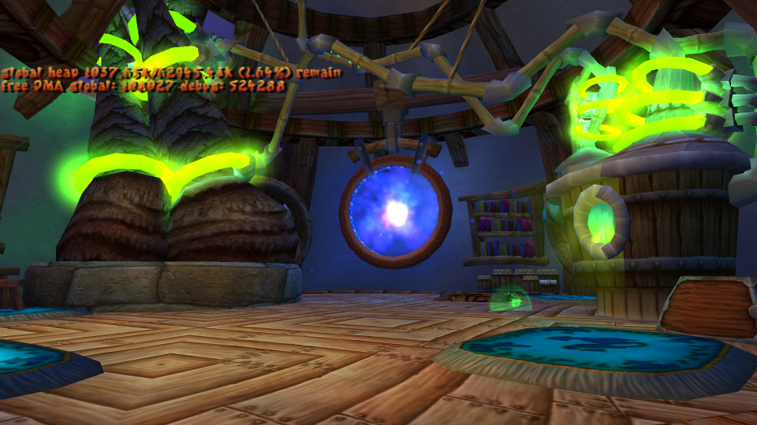
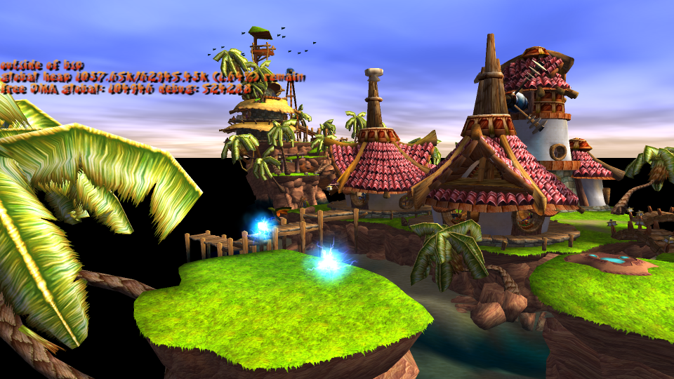

<p align="center">
  
</p>

<p align="center">
  <a href="https://water111.github.io/jak-project/" rel="nofollow"></a>
  <a target="_blank" rel="noopener noreferrer" href="https://github.com/water111/jak-project/workflows/Linux/badge.svg"></a>
  <a target="_blank" rel="noopener noreferrer" href="https://github.com/water111/jak-project/workflows/Windows/badge.svg"></a>
  <a href="https://coveralls.io/github/water111/jak-project?branch=master" rel="nofollow"></a>
  <a href="https://www.codacy.com/gh/water111/jak-project/dashboard?utm_source=github.com&amp;utm_medium=referral&amp;utm_content=xTVaser/jak-project&amp;utm_campaign=Badge_Grade" rel="nofollow"></a>
  <a href="https://discord.gg/E7yFpd6w9G"></a>
  <a href="https://makeapullrequest.com"></a>
</p>

## Table of Contents

<!-- toc -->

- [Table of Contents](#table-of-contents)
- [Project Description](#project-description)
- [Current Status](#current-status)
- [What's Next](#whats-next)
- [Getting Started - Linux (Ubuntu)](#getting-started---linux-ubuntu)
- [Getting Started - Linux (Arch)](#getting-started---linux-arch)
- [Getting Started - Nixpkgs](#getting-started---nixpkgs)
- [Getting Started - Windows](#getting-started---windows)
- [Building and Running the Game](#building-and-running-the-game)
  - [Extract Assets](#extract-assets)
  - [Build Game](#build-game)
  - [Run Game](#run-game)
- [Project Layout](#project-layout)
- [Directory Layout](#directory-layout)
  - [On Windows / Visual Studio](#on-windows--visual-studio)

<!-- tocstop -->

## Project Description

This project is to port Jak 1 (NTSC, "black label" version) to PC. Over 99% of this game is written in GOAL, a custom Lisp language developed by Naughty Dog. Our strategy is:
- decompile the original game code into human-readable GOAL code
- develop our own compiler for GOAL and recompile game code for x86-64
- create a tool to extract game assets into formats that can be easily viewed or modified
- create tools to repack game assets into a format that our port uses.

Our objectives are:
- make the port a "native application" on x86-64, with high performance. It shouldn't emulated, interpreted, or transpiled.
- Our GOAL compiler's performance should be around the same as unoptimized C.
- try to match things from the original game and development as possible. For example, the original GOAL compiler supported live modification of code while the game is running, so we do the same, even though it's not required for just porting the game.
- support modifications. It should be possible to make edits to the code without everything else breaking.

We support both Linux and Windows on x86-64.

We have a Discord server where we discuss development. https://discord.gg/BVEHQmm8

## Current Status
So far, we've decompiled around 341,233 lines of GOAL code, out of an estimated 500,000 total lines and we've started work on an OpenGL renderer. Currently, the main display process (`*dproc*`) runs and sends data to our renderer. We can load textures, text files, and level files. Using keyboard controls, we can open the debug menu and turn on some simple debug visualizations.

Here are some screenshots of the renderer:



YouTube playlist:
https://www.youtube.com/playlist?list=PLWx9T30aAT50cLnCTY1SAbt2TtWQzKfXX

To help with decompiling, we've built a decompiler that can process GOAL code and unpack game assets. We manually specify function types and locations where the original code had type casts until the decompiler succeeds, then we clean up the output of the decompiled code by adding comments and adjusting formatting, then save it in `goal_src`. Our decompiler is designed specifically for processing the output of the original GOAL compiler. As a result, when given correct casts, it often produces code that can be directly fed into a compiler and works perfectly. This is tested as part of our unit tests, and so far we have around 300,000 lines (380 files) that pass.

We don't save any assets from the game - you must bring your own copy of the game and use the decompiler to extract assets.

## What's Next

- Continue decompilation of GOAL code. We've made huge progress recently in decompiling gameplay code. We're finishing that up and also working on the some of the rendering and collision code. Here's our decompilation progress over the past year: 
- Start running gameplay code! We can now spawn simple actors like particle effects and collectables.
- Improve the decompiler. We are always finding new features and macros in the GOAL language.
- Investigate more complicated renderers. We have an in-progress port of the "tfrag" background renderer, shown in the screenshots above.

## Getting Started - Linux (Ubuntu)

Install packages and init repository:

```sh
sudo apt install gcc make cmake build-essential g++ nasm clang-format
git submodule update --init --recursive
```

Compile:

```sh
cmake -B build && cmake --build build -j 8
```

Run tests:

```sh
./test.sh
```

Note: we have found that `clang` and `lld` are significantly faster to compile and link than `gcc`, generate faster code, and have better warning messages. To install these:
```sh
sudo apt install lld clang
```
and run `cmake` (in a fresh build directory) with:
```sh
cmake -DCMAKE_SHARED_LINKER_FLAGS="-fuse-ld=lld" -DCMAKE_EXE_LINKER_FLAGS="-fuse-ld=lld" -DCMAKE_C_COMPILER=clang -DCMAKE_CXX_COMPILER=clang++ ..
```

## Getting Started - Linux (Arch)

Install packages and init repository:

```sh
sudo pacman -S gcc make cmake base-devel g++ nasm
git submodule update --init --recursive
```

Compile:

```sh
cmake -B build && cmake --build build -j 8
```

Run tests:

```sh
./test.sh
```

## Getting Started - Nixpkgs

If your Nix supports flakes:

```sh
nix develop # development environment
nix build # package
nix develop '.#jak-asan-dev' # development environment with Clang
nix build '.#jak-asan' # package with Clang ASan build
```

Otherwise, with traditional Nix:

```sh
nix-shell # development environment
nix-build # package
nix-shell -A packages.x86_64-linux.jak-asan-dev # development environment with Clang
nix-build -A packages.x86_64-linux.jak-asan # package with Clang ASan build
```

## Getting Started - Windows

Install Visual Studio 2022 and get the `Desktop development with C++` workload during the installation process.

> if you already have visual studio and don't have this installed - open your `Visual Studio Installer` and modify the installation

On Windows, it's recommended to get Scoop to use as a package manager, making the follow steps _much_ easier. Follow the steps on the bottom of the homepage here https://scoop.sh/

Once Scoop is installed, run the following command:

```sh
scoop install git llvm nasm
```

Initialize the repository's third-party dependencies:

```sh
git submodule update --init --recursive
```

Open the project as a CMake project.


Then build the entire project


## Building and Running the Game

Getting a running game involves 4 steps:
1. Build C++ tools (follow steps above)
2. Extract assets from game
3. Build game
4. Run game

### Extract Assets
Running the decompiler on the entire game is slow and not needed, so it is recommended to just run it on data. Edit `decompiler/config/jak1-ntsc_black_label.jsonc` and disable `decompile_code`.
```json
  "decompile_code": false, // change this to false, don't decompile code
```

Place a copy of the game's files in `iso_data` (on Windows, make a `jak1` subfolder and place the files there), then run the decompiler with the `scripts/shell/decomp.sh` (Linux) or `scripts/batch/decomp-jak1.bat` (Windows) script.

### Build Game
Run the OpenGOAL compiler `build/goalc/goalc`, or use one of the `gc` scripts. Enter `(mi)` to build the `"iso"` target, which contains everything we have placed in the build system so far.

### Run Game
In a separate terminal, start the runtime with `build/game/gk -fakeiso -debug`. Then, in the OpenGOAL window, run `(mi)` to create the data for the game and give the REPL information for running code, `(lt)` to connect, `(lg)` to load the game engine and `(test-play)` to start the game engine. If it all works right, it will look something like this:
```
g > (lt)
[Listener] Socket connected established! (took 0 tries). Waiting for version...
Got version 0.8 OK!
[Debugger] Context: valid = true, s7 = 0x147d24, base = 0x2123000000, tid = 2438049

gc> (lg)
10836466        #xa559f2              0.0000        ("game" "kernel")

gc> (test-play)
(play :use-vis #t :init-game #f) has been called!
0        #x0              0.0000        0

gc>
```
Then, in the graphics window, you can use the period key to bring up the debug menu. Controllers also work, using the same mapping as the original game.

Check out the `pc_debug` and `examples` folder under `goal_src` for some examples of GOAL code we wrote. They have instructions for how to run them.

## Project Layout
There are four main components to the project.

The first is `goalc`, which is a GOAL compiler for x86-64. Our implementation of GOAL is called OpenGOAL. All of the compiler source code is in `goalc`. To run the compiler on Linux, there is a script `gc.sh`. On Windows, there is a `gc.bat` scripts and a `gc-no-lt.bat` script, the latter of which will not attempt to automatically attach to a running target. The compiler is controlled through a prompt which can be used to enter commands to compile, connect to a running GOAL program for interaction, run the OpenGOAL debugger, or, if you are connected to a running GOAL program, can be used as a REPL to run code interactively. In addition to compiling code files, the compiler has features to pack and build data files.

The second component to the project is the decompiler. You must have a copy of the PS2 game and place all files from the DVD into the `iso_data` folder. Then run `decomp.sh` (Linux) to run the decompiler. For Windows, it is the `decomp-jak1.bat` file, and it wants your game's DVD files in a `jak1` folder inside `iso_data`. The decompile will extract assets to the `assets` folder. These assets will be used by the compiler when building the port, and you may want to turn asset extraction off after running it once. The decompiler will output code and other data intended to be inspected by humans in the `decompiler_out` folder. Stuff in this folder will not be used by the compiler.

The third is the game source code, written in OpenGOAL. This is located in `goal_src`. All GOAL and GOOS code should be in this folder. Right now most of this is placeholders or incomplete, but you can take a look at `kernel/gcommon.gc` or `goal-lib.gc` to see some in-progress source code.

The final component is the "runtime", located in `game`. This is the part of the game that's written in C++. In the port, that includes:
- The "C Kernel", which contains the GOAL linker and some low-level GOAL language features. GOAL has a completely custom dynamically linked object file format so in order to load the first GOAL code, you need a linker written in C++. Some low-level functions for memory allocation, communicating with the I/O Processor, symbol table, strings, and the type system are also implemented in C, as these are required for the linker. It also listens for incoming messages from the compiler and passes them to the running game. This also initializes the game, by initializing the PS2 hardware, allocating the GOAL heaps, loading the GOAL kernel off of the DVD, and executing the kernel dispatcher function. This is in the `game/kernel` folder. This should be as close as possible to the game, and all differences should be noted with a comment.
- Implementation of Sony's standard library. GOAL code can call C library functions, and Naughty Dog used some Sony library functions to access files, memory cards, controllers, and communicate with the separate I/O Processor. The library functions are in `game/sce`. Implementations of library features specific to the PC port are located in `game/system`.
- The I/O Processor driver, Overlord. The PS2 had a separate CPU called the I/O Processor (IOP) that was directly connected to the DVD drive hardware and the sound hardware. Naughty Dog created a custom driver for the IOP that handled streaming data off of the DVD. It is much more complicated than I first expected. It's located in `game/overlord`. Like the C kernel, we try to keep this as close as possible to the actual game.
- Sound Code. Naughty Dog used a third party library for sound. We have not started on this yet.
- PC specific graphics stuff. We have a functional OpenGL renderer and context that can create a game window and display graphics on it. The specific renderers used by the game however are mostly unimplemented. We have a debug, sprite and tfrag renderers, which is enough to render most of the game world, on-screen text and sprites like the progress menu. This is located in `game/graphics`. Many liberties will be taken to make this work, but the end result should closely match the actual game.

## Directory Layout

- `assets`: extracted assets (textures, translated game text, audio) generated by the decompiler. Not included in the repository. This data is used when building the PC port.
- `build`: C++ CMake build folder.
- `common`: common C++ code shared between the compiler, decompiler, and game.
    - `audio`: tools for decoding the audio files.
    - `cross_os_debug`: platform-independent library for implementing the OpenGOAL debugger. Linux and Windows.
    - `cross_sockets`: platform-independent library for sockets. Used to connect the compiler to a running game. Linux and Windows.
    - `goos`: the compiler-time macro language and parser for OpenGOAL.
    - `type_system`: the OpenGOAL type system.
    - `texture`: texture unpacking and format conversion.
    - `dma`: utilities for handling the transfer of PS2 DMA packets.
    - `util`, `math`, `log`: Random utility functions for accessing files, timers, etc.
- `decompiler`: Source code for the decompiler.
    - `analysis`: analysis algorithms.
    - `config`: JSON config files for the decompiler and type definition file.
    - `data`: utilities to extract assets from the game.
    - `Disasm`: MIPS disassembler.
    - `Function`: Tools for analyzing GOAL functions.
    - `gui`: an early prototype of a Python GUI for reading the output of the decompiler.
    - `IR2`: the "Intermediate Representation" for GOAL functions and expressions.
    - `ObjectFile`: Utilities for processing the GOAL object file format.
    - `scripts`: Useful scripts for setting up the decompilation.
    - `util`: random utilities.
    - `VuDisasm`: disassembler for VU code.
- `decompiler_out`: output of the decompiler that's not automatically used by the compiler. This is for humans to read and use. Not included in the repository.
- `docs`: more documentation!
- `game`: the source code for the game executable.
    - `common`: shared stuff between the `kernel` (EE) and `overlord` (IOP).
    - `graphics`: PC Port graphics.
    - `kernel`: the part of the GOAL kernel written in C. The entry point for the game is in `kboot.cpp`.
    - `overlord`: the I/O processor driver used to get data off of the DVD.
    - `sce`: the Sony library implementation.
    - `system`: PC-port specific OS-level stuff, like file I/O, threads, controllers, debug network connection.
- `goal_src`: The GOAL code for the game.
    - `build`: info related to the GOAL build system.
    - `engine`: the game engine.
    - `kernel`: The GOAL kernel.
    - `levels`: Level specific code.
    - `old`: Unused or deleted files from the original game.
    - `dgos`: File lists for DGOs in the build system.
    - `examples`: Example GOAL code we have written.
    - `test`: Test code we have written.
    - `pc_debug`: GOAL code for PC-specific debugging. Also written by us.
    - `user`: User sandboxes. Written by you! And anyone else that wishes to share their user code.
- `goalc`: The OpenGOAL compiler.
    - `compiler`: The implementation of the OpenGOAL language.
    - `data_compiler`: Tools for packing data.
    - `debugger`: The OpenGOAL debugger (part of the compiler).
    - `emitter`: x86-64 emitter and object file generator.
    - `listener`: The OpenGOAL listener, which connects the compiler to a running GOAL program for the interactive REPL.
    - `make`: The OpenGOAL build system, builds both code and data files.
    - `regalloc`: Register allocator.
- `iso_data`:
- `out`: Outputs from the build process. Only the `iso` subfolder should contain assets used by the game.
    - `iso`: Final outputs that are used by the game.
    - `obj`: Object files generated by the compiler.
- `resources`: To be removed. Contains fake versions of some files required to get things booting.
- `scripts`: Utility scripts. Windows-specific batch files are in a `batch` folder while Unix shell scripts are in a `shell` folder.
- `test`: Unit tests (run on GitHub Actions).
- `third-party`: Third party libraries.
    - CMake Code Coverage. For code coverage statistics on GitHub builds.
    - `fmt`. String formatting library.
    - `googletest`: Test framework.
    - `inja`: templating library used for generating test code for compiler tests.
    - `lzokay`: decompression code for Jak 2 and later DGOs.
    - `mman`: Windows library used to emulate `mmap` on Linux.
    - `run-clang-format`: Utility to check and enforce code formatting.
    - `run-clang-tidy`
    - `zydis`: x86-64 disassembler used in the OpenGOAL debugger.
    - `json`: A JSON library.
    - `replxx`: Used for the REPL input. Supports history and useful editing shortcuts.
    - `svpng`: Save a PNG file.

### On Windows / Visual Studio

Until 16.9 Preview 4, when attaching a debugger to the ASan build, you must disable breaking on Win32 Access Violation exceptions. See the relevant section `Debugging - Exceptions` here https://devblogs.microsoft.com/cppblog/asan-for-windows-x64-and-debug-build-support/#known-issues
