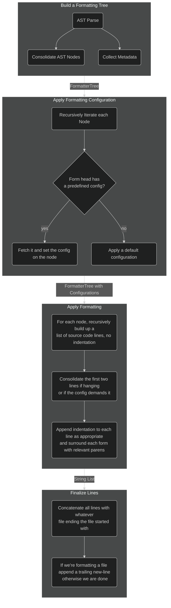
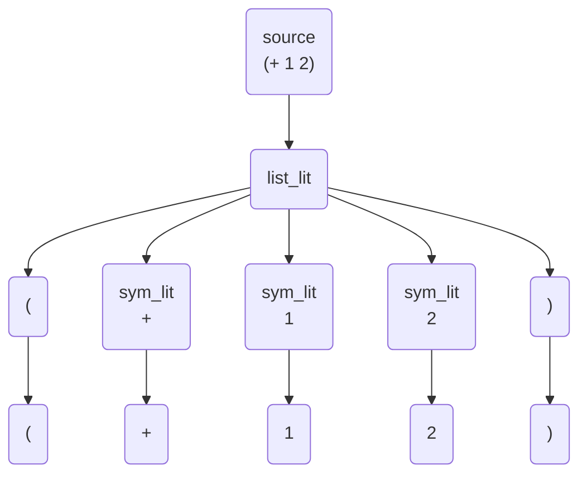
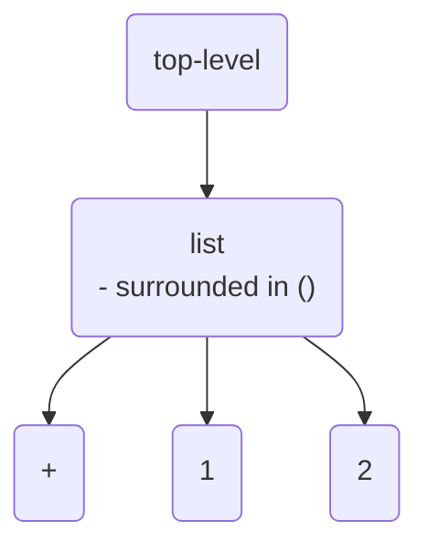

# OpenGOAL Formatter Documentation

> [!IMPORTANT]
> This is still in a highly experimental state, adjust your expectations accordingly.

Despite LISP being very simple, and taking the stance of a highly opinionated formatter that doesn't concern itself with line-length in most situations writing a code formatter is still an incredibly annoying and difficult thing to do.  This documentation serves as a place for me to collect my thoughts and explain how it works (or more likely, how it does not).

Also in general I found it _really_ hard to find modern and easy to understand articles on how to get started (with the exception of zprint's usage docs, but that doesn't really cover implementation ideas).  This area is either dominated by 40 year old journal articles, or discussions around really difficult formatting projects.  There isn't a whole lot in the vain of _here's how I made a decent, simple formatter_, so maybe it'll help someone else (even if it's teaching them potentially what not to do!)

## Architecture / Overview

Atleast for me, it helps to understand the path code takes as it flows through the formatting process.  Originally I tried to do as much at once for sake of efficiency but this just makes things incredibly hard to reason about and fix bugs.  So like any problem that is complex, break it down, the formatter goes through many distinct phases chipping away at the problem:



### Build a Formatting Tree

At the end of the day, formatting is about changing the location and amounts of white-space in a file.  Meaning it would be ideal if we could start with a representation that is whitespace-agnostic.  Some formatters (like cljfmt) choose to use the original whitespace as an input into the formatting process, essentially meaning that your code should already be somewhat-formatted.  This is somewhat advantageous as it can simplify the formatter's implementation or be a bit more flexible as to what the original programmer intended (assuming they knew what they were doing).  But of course it has one fatal flaw -- the code has to already be well formatted.

For our formatter I wanted it to be able to take in horribly, ugly, minified code and output an optimal result -- especially since so much of our code gets spat out by another tool.  To do that, we need to be able to format the code without any existing whitespace helping us, adding in the whitespace from the ground up.

The easiest way to do this is to construct an AST of the language which has a lot of other benefits for building language features but for here all we care about is getting rid of the whitespace and having some basic interpretation of the source code structure.  The easiest way now-a-days to make an AST for a language is to create a [treesitter grammar](https://github.com/open-goal/tree-sitter-opengoal).

#### Consolidate AST Nodes and Collect Metadata

One downside with using an AST, atleast with the way the grammar is currently implemented is it creates a somewhat difficult tree to work with from a formatting perspective.  For example in a LISP, everything is a list.  In our AST it does not look like how you may intuitively expect:

`(+ 1 2)`



vs what you would probably prefer:



As you can see from even this simple example, the AST representation can be very verbose and in a sense has duplication.  Each node is aware of it's original location in the parsed source-code, but it's the leaf-node tokens that we care about for formatting and perhaps the form types they were a part of (ie. were they comments or in a list, etc).

So to keep things brief, the AST representation is a bit too cumbersome and superfluous to use for formatting directly.  So the first step is recurse through it and optimize it, removing unneeded height and capturing crucial metadata that is actually relevant for formatting.

We build a `FormatterTree` which consists of `FormatterNode`s.  Each `FormatterNode` has either a single token, or a list of `refs`.  A `ref` is just another `FormatterNode`.  Each node also has a bunch of metadata and configuration on how it should be formatted (just initialized for now).

Having a dead-simple representation of the code like this is really only possible because it's a LISP, but it's also future proofed for us.  If OpenGOAL ever decides to support different brackets -- for example in Clojure a vector uses `[]` or a map uses `{}` it would be easy for update the formatter to wrap each list node in the right bracket type.

### Applying Formatting Configuration

Now that we have our simplified tree, we can get to actually formatting.  The first step is to figure out _how_ we intend to format things.  By separating this from the actual formatting it's a lot easier to reason about and find bugs.  You can also do potentially interesting things, where you do a full traversal of your source-code tree to figure out an optimal decision without trying to build up the final formatted string at the same time.

It is lists, or `form`s that we care about figuring out how to format.  Each `form` has a head element (unless it's empty) that we can use to specify how it would be formatted.  For example we cannot specify the formatting for every single function name, but we can format a `defun` or a `let` in a special way.  With this mechanism, the formatter is easily extensible and configurable.  There is even the ability to specify formatting configuration for a list's children by index -- for example you may want to format the first element in a `let` (the binding list) differently than the rest of the code.

There are also some forms that don't have a head-item, that we still identify and set some default formatting rules:
- The top-level node - indentation is disabled
- Lists of only literals, called `constant lists` - These are indented with `1` space instead of the default `2` for a `flow`'d form.
  - If these lists literals are paired with keywords we call these `constant pairs` - We strive to put the pairs on the same line, if they are too long we spill to the next with `2` space indentation
- TODO - cond/case pairs (similar to constant pairs)

This brings up two important terms that you will see in the formatter implementation a lot -- `flow` and `hang`.  The difference is as such:

```clj
(println "this"
         "form"
         "is"
         "hung / hanged")
```

```clj
(println
  "this"
  "form"
  "is"
  "flowed")
```

The difference between the two other than visually is that hanging always results in 1 less line spent _because we don't care about line-length_.  This is great because it means we can always default to hanging unless overridden.  Flowing trades off that 1 vertical line for horizontal space and looks great for block-style forms.  Like the top-level of a `defun` or the content of a `let`.

### Applying Formatting

The final real-step in the process, actually using the configuration and generating the formatting code.  This phase is actually broken up into 3 sub-phases as we recurse through the `FormatterTree`

#### Build Lines

First we build the source code lines without indentation, it's a lot easier to figure out the indentation after all tokens are on the correct lines instead of doing it in tandem.  Most tokens are given their own line, but in the case of a hung form we combine the first two elements on the first line.  Other forms are formatted in even more complicated ways, or comments that were originally inline should remain next to that token.

Secondly, once we have all our consolidated lines we can apply the indentation.  This is most often based on the configuration of the list node itself.  For example a `hung` form must be indented the width of a `(` and the length of the head-form, plus the whitespace separator -- conversely a `flowed` form only needs to be indented by `2` spaces, regardless of token length.  Because all of these algorithms are recursive we can hyper-focus on getting the indentation and formatting correct from the bottom-up.  In otherwords, we don't care if a form is 200 spaces indented into a function, once the lines are returned recursively, they will get another layer of indentation added on until we hit the top-level node.

### Finalize Lines

Finally, we concatenate our list of strings, respecting the original file's line-endings.

As it is best practice, if we are formatting an entire file we should terminate with a trailing new-line.

Both of these items are technically a TODO.

## Configuration

TODO

## Reference

This formatter is highly influenced by a lot of other existing formatters and writings.  The most significant of which is Clojure's [zprint](https://github.com/kkinnear/zprint/tree/main/doc/options) which has incredible documentation around it's capabilities and why it chooses what to do.

The formatter I've built basically copies zprint in terms of basic functionality, but simplifies things by being even more opinionated (for example, doing far less in terms of trying to adhere to a line-length limit).

### Other references

- [The Hardest Program I’ve Ever Written - Dart Formatter](https://journal.stuffwithstuff.com/2015/09/08/the-hardest-program-ive-ever-written/)
- [cljfmt](https://github.com/weavejester/cljfmt)

### Why not respect a line-length limit

The OpenGOAL formatter will respect line-length in only very specific situations:
- When determining if a form can be fit entirely on a single line
- Probably in the future for multi-line comments

Besides it adding a massive amount of complexity, even zprint explains that a line-length limit won't always be followed

> zprint will work very hard to fit the formatted output into this width, though there are limits to its effort.  For instance, it will not reduce the minimum indents in order to satisfy a particular width requirement.

Let's illustrate with an example:

```clj
(defun some-func
  (+ 123
     456
     (+ 123
        456
        ;; imagine this form exceeds our width, how can you "fix" this without
        ;; messing up the indentation levels of the entire expression
        ;; - you can't inline it (you're already past the width)
        ;; - you can't insert a line break because it'll still be at the same horizontal level
        (+ 123
           456
           789))))
```

In LISP code, we don't have many ideal options to deal with this, all options are syntactically correct, but in terms of conventional readability they are bad because when reading LISP code you want to use the indentation as a guide (which is why new-line parens are considered ugly by basically all LISP style guides)

The other reason which is equally relevant is it is hard, it means the formatter would have to try to find an optimal solution by exploring different solutions until it finds the one that minimizes lines.

But with an opinionated formatting style you can avoid this complexity, if you want your code to look nice don't write code like the decompiler sometimes outputs when it encounters something truly cursed:


> `game-save.gc` about 200+ nested `let`s!
